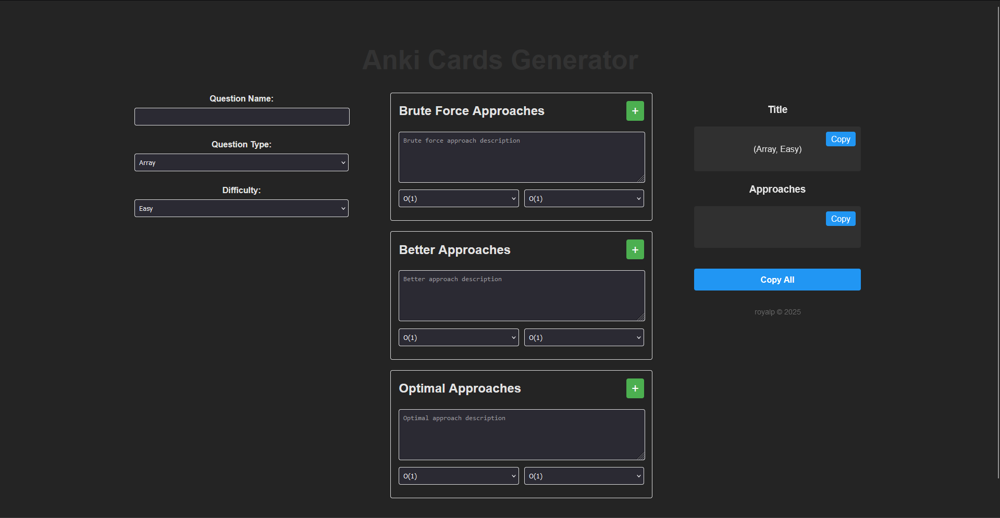

# Question Approach Generator

A sleek, interactive web application that helps developers document and format their algorithm problem-solving approaches. Built with Svelte, this tool makes it easy to organize and share different solution strategies for coding problems.



## Features

- **Intuitive Form Interface**
  - Input question details including name, type, and difficulty level
  - Document multiple approaches (Brute Force, Better, Optimal)
  - Dynamic addition of multiple approaches per category
  - Custom time and space complexity input support

- **Real-time Preview**
  - Live formatting of your input
  - Side-by-side layout for immediate feedback
  - Sticky output panel for easy reference

- **Easy Copying**
  - Individual copy buttons for title and approaches
  - "Copy All" functionality for complete solution
  - Clipboard integration for seamless sharing

- **Responsive Design**
  - Clean, modern interface
  - Works on all screen sizes
  - Optimized layout for better usability

## Installation

1. Clone the repository:
```bash
git clone https://github.com/hiprathamesh/anki-for-dsa.git
```

2. Navigate to the project directory:
```bash
cd anki-for-dsa
```

3. Install dependencies:
```bash
npm install
```

4. Run the development server:
```bash
npm run dev
```

## Usage

1. **Fill in the Question Details**
   - Enter the question name
   - Select the question type (Array, String, etc.)
   - Choose difficulty level

2. **Add Approaches**
   - Document your approaches starting from Brute Force
   - Click '+' to add multiple approaches in each category
   - Select or enter custom time and space complexities
   - Remove additional approaches using the '×' button

3. **Copy and Share**
   - Use individual copy buttons for title or approaches
   - Click "Copy All" to get the complete formatted solution
   - Paste anywhere to share your approach

## Output Format

The generator creates two formatted text blocks:

1. **Title Format:**
```
Question Name (Type, Difficulty)
```

2. **Approaches Format:**
```
Brute: [Approach description]
TC: [Time Complexity] | SC: [Space Complexity]

Better: [Approach description]
TC: [Time Complexity] | SC: [Space Complexity]

Optimal: [Approach description]
TC: [Time Complexity] | SC: [Space Complexity]
```

## Technologies Used

- Svelte
- JavaScript
- HTML5
- CSS3

## Contributing

Contributions are welcome! Please feel free to submit a Pull Request. For major changes, please open an issue first to discuss what you would like to change.

1. Fork the Project
2. Create your Feature Branch (`git checkout -b feature/AmazingFeature`)
3. Commit your Changes (`git commit -m 'Add some AmazingFeature'`)
4. Push to the Branch (`git push origin feature/AmazingFeature`)
5. Open a Pull Request

## License

This project is licensed under the MIT License - see the [LICENSE](LICENSE) file for details.

## Acknowledgments

- Inspired by the need for consistent algorithm solution documentation
- Thanks to the Svelte community for the excellent framework
- All contributors who help improve this tool

## Contact

Prathamesh - [@hiprathamesh](https://linkedin.com/in/hiprathamesh/)
